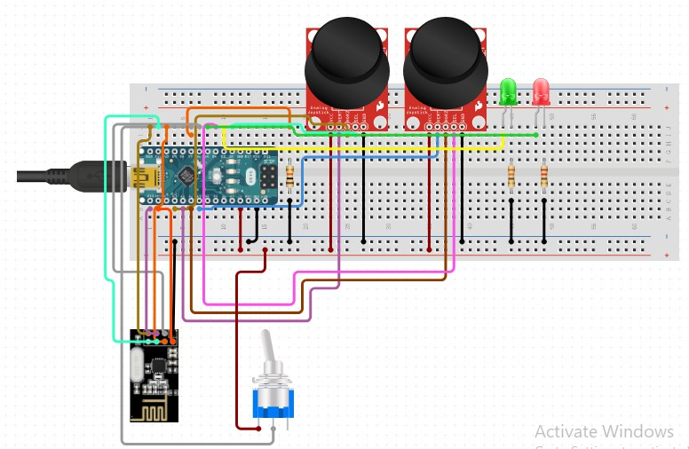
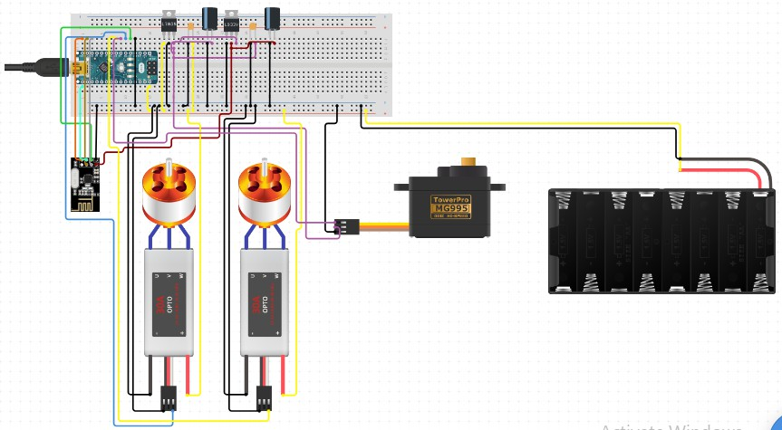

# Boat-Control-with-NRF24L01
Code for the transmitter and the receiver for the RC boat

the schematic of the transmitter looks like:

Basically the transmitter consist of 3 input, which are 2 joystick and 1 toggle switch. joystick on the left is used to increase or decrease the motor speed. the joystick on the right is used for driving the boat to the right or to the left. the toggle switch is used to decrease the maximum speed of the motor, and the 2 led is used to indicate on which max speed we are operate in. 

The schematic of the receiver looks like:

For the receiver, it has one servo and 2 motor. the 2 motor will drive simultaneously to give more power for the boat. the servo will drive 60 degrees to the left or the right according to the input from the right joystick. 

You can see the resulted boat that we make. my brother mainly focused on the design and body of the boat, while i focused mainly on the control system.

